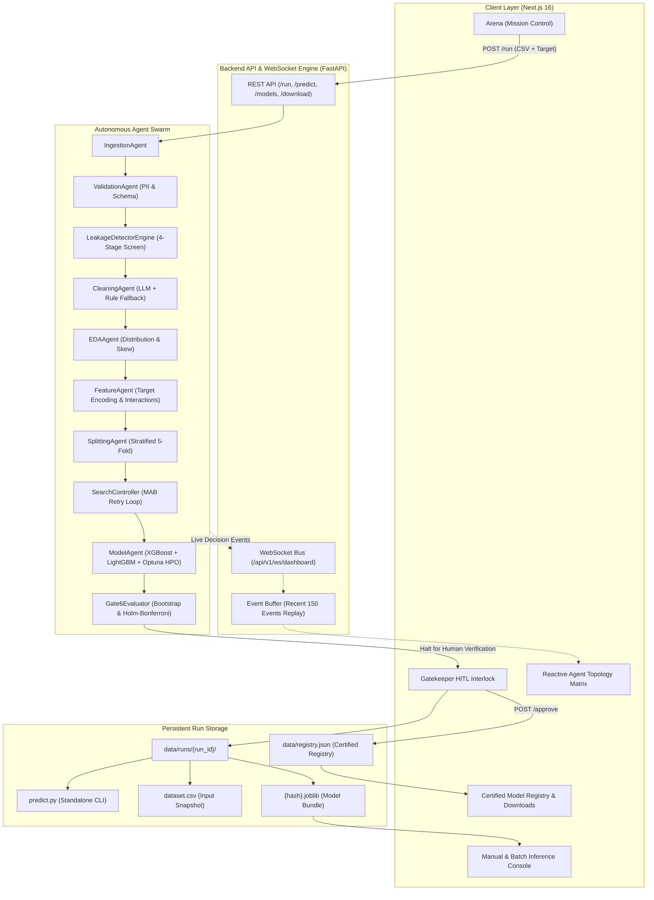

# AutoML Arena v2: Decentralized Multi-Agent Machine Learning Platform

> An enterprise-grade, autonomous machine learning swarm that automates ingestion, data cleaning, feature synthesis, model selection, hyperparameter optimization, and statistical certification with strict Human-in-the-Loop governance.

---

## Key Highlights & Capabilities

- **Decentralized Multi-Agent Swarm**: 9 specialized autonomous agents (`IngestionAgent`, `ValidationAgent`, `LeakageDetectorEngine`, `CleaningAgent`, `EDAAgent`, `FeatureAgent`, `PreprocessingAgent`, `SplittingAgent`, `ModelAgent`, `Gate6Evaluator`) orchestrated by a Multi-Armed Bandit `SearchController`.
- **Statistically Audited Quality Gates**: 6 progressive quality gates enforcing PII removal, 4-stage target leakage detection, cross-validation convergence, fairness audit, and Gate 6 bootstrap superiority testing with Holm-Bonferroni multiple testing corrections.
- **Dedicated Run Artifact Generation**: Every run automatically saves a dedicated folder (`data/runs/{run_id}/`) containing:
  - `{experiment_hash}.joblib`: Serialized production model bundle with preprocessing pipelines, decision thresholds, and metadata.
  - `dataset.csv`: Exact immutable snapshot of the input data used for training.
  - `predict.py`: Self-contained, executable CLI and importable Python script tailored to the model.
- **Modern Full-Stack Dashboard (Next.js 16 + FastAPI)**:
  - **Arena (Mission Control)**: Real-time dataset ingestion, CSV target column detection, stage gate progression, and a reactive SVG agent matrix with pulsating signal flows.
  - **Gatekeeper Interlock**: Human-in-the-Loop authorization gate positioned directly on the home page with Canary deployment triggers and 1-click downloads.
  - **Certified Model Registry**: Production registry listing approved champions with 1-click `.joblib` and `predict.py` downloads.
  - **Inference Console**: Real-time interactive model testing with dynamic feature extraction and batch CSV prediction.
  - **System & Resource Monitor**: Real-time hardware telemetry (`psutil`: RAM, CPU %, Disk usage, artifact MB) without fabricated mock data.

---

## System Architecture & Data Flow



---

## Quickstart Guide

### Prerequisites
- Python 3.11+
- Node.js 18+ and `npm`

### 1. Start the FastAPI Backend
```bash
# In the project root directory:
python -m uvicorn app.api.main:app --host 0.0.0.0 --port 8000 --reload
```
- Interactive Swagger UI: [http://localhost:8000/docs](http://localhost:8000/docs)
- System Telemetry: [http://localhost:8000/api/system/telemetry](http://localhost:8000/api/system/telemetry)

### 2. Start the Next.js Frontend
```bash
# In another terminal:
cd frontend
npm run dev
```
- Open your browser at [http://localhost:3000](http://localhost:3000)

---

## Operational Walkthrough

1. **Upload Dataset & Launch Run**:
   - Go to [http://localhost:3000](http://localhost:3000) (**Arena** tab).
   - Select any tabular CSV dataset.
   - Choose the target column.
   - Click **Launch Arena Pipeline**.
2. **Watch Real-Time Swarm Progress**:
   - The **Decentralized Agent Matrix** SVG dynamically pulses glowing signal lines from the CORE to the active agent node (`CleaningAgent`, `EDAAgent`, `FeatureAgent`, `ModelAgent`, `Gate6Evaluator`).
   - The **Live Decisions Terminal** streams real-time agent reasoning, decisions, and confidence scores.
3. **Authorize Candidate Champion (HITL Gatekeeper)**:
   - When Gate 6 completes, the **Gatekeeper Interlock** card displays candidate model specifications and statistical pass status.
   - Click **Approve & Trigger Canary Deploy** to promote the model to the production registry.
4. **1-Click Downloads**:
   - Scroll to the **Certified Model Registry & Download Center**.
   - Click **Download `.joblib`** to get the trained model binary bundle.
   - Click **Download `predict.py`** to get the standalone Python prediction script.
5. **Run Predictions**:
   - Click **Run Live Prediction on this Model** (or open the **Manual Prediction** tab).
   - The interface dynamically inspects the model's feature atoms (`Brand`, `Year`, `KilometersDriven`, `EngineCC`, etc.) and renders interactive input fields.
   - Click **RUN REAL-TIME PREDICTION** to execute low-latency inference on the trained `.joblib` model.
   - Use **Batch CSV Prediction** to upload entire datasets for bulk inference.

---

## Dedicated Run Artifact Directory

Every run creates a dedicated, self-contained directory:

```
data/runs/{run_id}/
├── {experiment_hash}.joblib    # Bundled scikit-learn/XGBoost pipeline, feature names & threshold
├── dataset.csv                 # Exact dataset snapshot used during training
└── predict.py                  # Standalone CLI prediction script
```

### Standalone Inference via CLI
The generated `predict.py` operates independently without requiring the web server:

```bash
# Usage: python data/runs/{run_id}/predict.py <input_csv>
python data/runs/api_run/predict.py test_data.csv
```

---

## Statistical Quality Gates

| Gate | Name | Audit Mechanism |
| :--- | :--- | :--- |
| **Gate 1** | Sanity & Distribution | Detects NaN rate, infinite values, constant features, and extreme zero-variance. |
| **Gate 2** | 4-Stage Leakage Screen | Purges features with univariate AUC $\ge 0.98$, mutual info leakage, or temporal ordering anomalies. |
| **Gate 3** | Cross-Validation Convergence | Evaluates 5-fold cross-validation variance ($\sigma_{\text{CV}} < 0.08$) to avoid unstable splits. |
| **Gate 4** | Robustness & Sensitivity | Tests model stability against noise injection and adversarial perturbation. |
| **Gate 5** | Fairness & Demographic Parity | Evaluates worst-slice disparity across protected attributes ($< 5.0\%$ threshold). |
| **Gate 6** | Statistical Certification & HITL | 1,000-fold Bootstrap Paired Test vs Baseline, Holm-Bonferroni correction ($\alpha = 0.05/K$), and mandatory Human authorization. |

---

## Core API Reference

| Endpoint | Method | Purpose |
| :--- | :--- | :--- |
| `/api/experiments/run` | `POST` | Upload CSV, set target, and trigger autonomous pipeline execution. |
| `/api/experiments/pending` | `GET` | Retrieve candidate champions currently awaiting Gate 6 human approval. |
| `/api/experiments/approve` | `POST` | Authorize candidate model and deploy to production registry. |
| `/api/experiments/reject` | `POST` | Reject candidate model and return to search pool. |
| `/api/experiments/download/{hash}` | `GET` | Direct 1-click download of the `.joblib` binary bundle. |
| `/api/experiments/download-script/{run_id}` | `GET` | Direct 1-click download of the standalone `predict.py` script. |
| `/api/predict` | `POST` | Execute low-latency real-time inference on input feature JSON. |
| `/api/predict/features` | `GET` | Dynamic schema inspection: returns required features and sample values for a model. |
| `/api/predict/batch` | `POST` | Bulk CSV evaluation: upload CSV and get row-by-row predictions. |
| `/api/system/telemetry` | `GET` | Real host machine telemetry (`psutil`: RAM, CPU load, disk usage, artifact sizes). |
| `/api/v1/ws/dashboard` | `WebSocket` | Live streaming bus with automatic 150-event historical replay on connect. |
